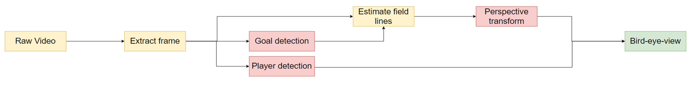

# Deep Learning Estimation of 2D Position of Football Field Elements and Players – VEO

- The goal is to create a system capable of detecting players, the field and then be able to apply a prospective transformation to show the position of players on a 2d field. Deep learning models were applied in all the sections marked in red in the project outline below.
---
## Project outline

<!-- If you have screenshots you'd like to share, include them here. -->

## General Information

- The final result is contained in a jupyter notebook in the Final version folder (final_script.ipynb) 
- All the other folders contain different independent parts developed during this project, the ones used for the final version as well as the ones who had potential to be used.
- General structure:
    - Goal detection
    - Player detection
    - Perspective transform
    - Bird-eye-view

## Data
- The *Football goal* subfolder inside *Data* contains images used to detect a football goal
- The *Not Football goal* subfolder inside *Data* contains images used to not detect a football goal

## Object Detection

The model trained and used for object detection was too large to upload to github, but the results can be seen in the .ipynb script in the *Object detection* folder. This part was also not used in the final result.

## Group members:

- Samuel Poltock (s212973)
- Thor Larsen (s171198)
- Paweł Zieliński (s213231)
- Vilhjálmur Kári Jensson (s212942)
- José Turégano Pérez (s212751)

